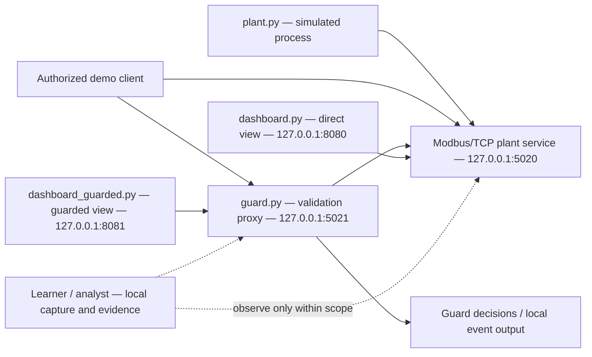

# Reference Architecture — Supplied Student Simulation

This diagram describes the course-provided implementation in `labs/ot-security/student-lab-source/`. Learners inspect and explain this architecture; a replacement design is not required. All student-run services and demonstration clients are restricted to loopback inside the assigned Ubuntu VM.

## Component roles

| Component | Supplied role | Learner investigation |
|---|---|---|
| `plant.py` | Simulated process values and Modbus/TCP endpoint | Identify process variables, normal state, update behaviour and register mapping. |
| `guard.py` | Local validation/forwarding path | Explain range, step and rolling-baseline checks; identify what is and is not protected. |
| `dashboard.py` | Direct, unguarded process view | Compare normal and simulated process behaviour. |
| `dashboard_guarded.py` | View through the guard | Relate displayed state to guard response and logs. |
| Demonstration scripts | Bounded local examples | Use only as described in the Student Lab Guide and approved test plan. |
| Learner/analyst | Local packet, log and screenshot collection | Create and interpret evidence without leaving the loopback scope. |

The supplied guard is an educational example, not a production security or process-safety control. Its limitations, assumptions and possible complementary controls are part of the analysis.

## Safety note

Use only the canonical student source. Do not execute `labs/ot-security/archive-original/`. Do not scan or connect to any non-loopback host. If any target/bind address is not `127.0.0.1`, stop and contact the instructor.
