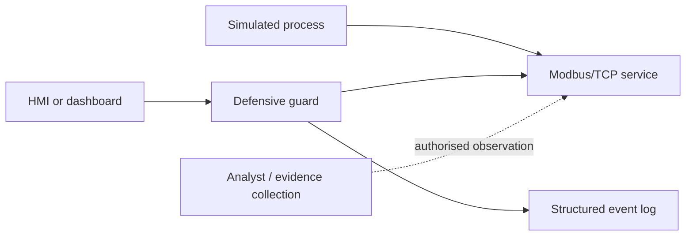

# Reference Architecture — Concept Only

This diagram shows the expected **roles**, not a completed implementation. Learners choose their own tools and original design inside the authorised isolated lab.

## Role definitions

| Role | Required contribution |
|---|---|
| Simulated process | Produces understandable process state and normal behaviour |
| Modbus/TCP service | Exposes documented data points in the isolated simulation |
| HMI/dashboard | Displays normal operational state to the authorised user |
| Defensive guard | Validates, restricts or alerts on unsafe conditions |
| Analyst | Collects packet, log and system-state evidence without leaving scope |

The logical guard may be implemented inline, as a proxy, as a monitoring/validation service or by another instructor-approved approach. Document the exact behaviour and its limits.
